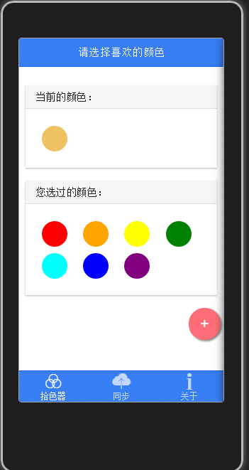

# 简单拾色器

## 简介
- 项目架构：使用[Ionic](http://ionicframework.com/)的视图风格，[Angular](https://angularjs.org/)的MVC模式。
- 项目演示：手机浏览器下载安装：[iOS版](http://fir.im/colorpicker)
- 设计原型：[Material Colorpicker](https://dribbble.com/shots/2013584-Material-Colorpicker?list=searches&tag=material&offset=11)

## 运行
 - 部署：npm install
 - Web端运行：npm start
 - 单元测试：npm test
 - 源文件压缩：gulp 